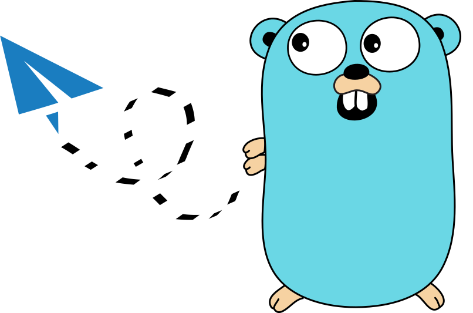

# Shadowsocks server

Focuses on a Dockerized Shadowsocks server as well as giving an easy to use Go API to run a Shadowsocks server.



❓ Question, suggestion, request? ➡️ [Create an issue!](https://github.com/qdm12/ss-server/issues/new)

[](https://github.com/qdm12/ss-server/actions/workflows/ci.yml)

[](https://hub.docker.com/r/qmcgaw/ss-server)


[](https://hub.docker.com/r/qmcgaw/ss-server/tags?page=1&ordering=last_updated)


[](https://hub.docker.com/r/qmcgaw/ss-server/tags)

[](https://github.com/qdm12/ss-server/commits/main)
[](https://github.com/qdm12/ss-server/graphs/contributors)
[](https://github.com/qdm12/ss-server/pulls?q=is%3Apr+is%3Aclosed)
[](https://github.com/qdm12/ss-server/issues)
[](https://github.com/qdm12/ss-server/issues?q=is%3Aissue+is%3Aclosed)

[](https://github.com/qdm12/ss-server)


[](https://github.com/qdm12/ss-server/master/LICENSE)


## Docker

The Docker image is:

- Based on Scratch (no OS) for a total size of **3.53MB**
- Compatible with all the CPU architectures supported by Docker: `linux/amd64`, `linux/386`, `linux/arm64`, `linux/arm/v6`, `linux/arm/v7`, `linux/s390x`, `linux/ppc64le` and `linux/riscv64`
- Shadowsocks is implemented in Go and compiled statically using Go 1.16

Run the container interactively to try it out

```sh
docker run -it --rm -p 8388:8388/tcp -p 8388:8388/udp -e PASSWORD=password qmcgaw/ss-server
```

Or use docker-compose.yml with `docker-compose up -d`

```yml
version: "3.7"
services:
  shadowsocks:
      image: qmcgaw/ss-server
      container_name: shadowsocks
      network_mode: bridge
      ports:
          - 8388:8388/tcp
          - 8388:8388/udp
      environment:
          - PASSWORD=password
          - TZ=
      restart: always
```

The environment variables are:

| Name | Default | Possible values | Description |
| --- | --- | --- | --- |
| `PASSWORD` |  | Any password | Your password |
| `PORT` | `8388` | `1024` to `65535` | Internal listening port |
| `LOG_LEVEL` | `INFO` | `INFO`, `ERROR`, `DEBUG` | Log level |
| `CIPHER` | `chacha20-ietf-poly1305` | `chacha20-ietf-poly1305`, `aes-128-gcm`, `aes-256-gcm` | Cipher to use |
| `TZ` |  | Timezone, i.e. `America/Montreal` | Timezone for log times display |
| `PROFILING` | `off` | `on` or `off` | Enable the Go pprof http server on `:6060` |

## Go API

This repository was designed such that it is easy to integrate and launch safely a Shadowsocks server from an existing Go program.

### TCP+UDP example

[Source file](examples/tcp-udp/main.go)

```go
package main

import (
    "context"
    "fmt"
    "os"

    "github.com/qdm12/ss-server/pkg/tcpudp"
)

func main() {
    logger := &logger{}
    server, err := tcpudp.NewServer("aes-256-gcm", "password", logger)
    if err != nil {
        logger.Error(err.Error())
        os.Exit(1)
    }
    ctx := context.Background()
    err = server.Listen(ctx, ":8388") // blocking call, can be run in a goroutine
    if err != nil {
        logger.Error(err.Error())
    }
}

type logger struct{}

func (l *logger) Debug(s string) { fmt.Println("debug:", s) }
func (l *logger) Info(s string)  { fmt.Println("info:", s) }
func (l *logger) Error(s string) { fmt.Println("error:", s) }
```

The call to `server.Listen(ctx, ":8388")` is blocking but you can run in a goroutine and cancel the context `ctx` when you want to stop the server.

### TCP only and UDP only

API for the TCP only and UDP only are almost the same, with the difference that they return an error on exit.

- [TCP only example](examples/tcp/main.go)
- [UDP only example](examples/udp/main.go)

### Docker entrypoint

Have also a look at the [cmd/ss-server/main.go](cmd/ss-server/main.go) which is quite straight forward to understand but uses a bit more complex asynchronous parts.

### Testing

Interfaces are defined such as `github.com/qdm12/ss-server/pkg/tcpudp.Listener`:

```go
type Listener interface {
    Listen(ctx context.Context, address string) (err error)
}
```

Mocks are generated and committed to source control for each interfaces so you can directly use them with `gomock` for you tests. [For example](examples/test/main_test.go):

```go
package main

import (
    "context"
    "testing"

    "github.com/golang/mock/gomock"
    "github.com/qdm12/ss-server/pkg/tcpudp/mock_tcpudp"
)

func Test_Mytest(t *testing.T) {
    t.Parallel()
    ctrl := gomock.NewController(t)
    defer ctrl.Finish() // for Go < 1.14

    ctx := context.Background()

    server := mock_tcpudp.NewMockListener(ctrl)
    server.EXPECT().Listen(ctx, ":8388").Return(nil)

    err := server.Listen(ctx, ":8388")
    if err != nil {
        t.Error("not expecting an error")
    }
}
```

## On demand

- SIP003 plugins

## TODOS

- Support hex raw keys instead of passwords
- Entrypoint message
- Prometheus stats
- Docker healthcheck + healthcheck endpoint (i.e. for K8s)
